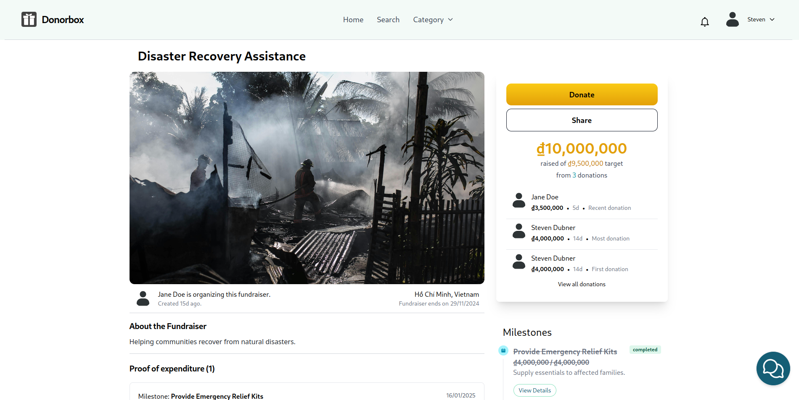
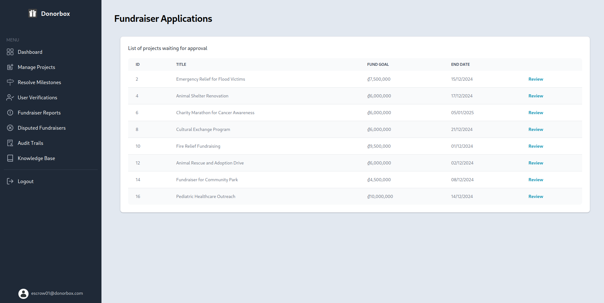
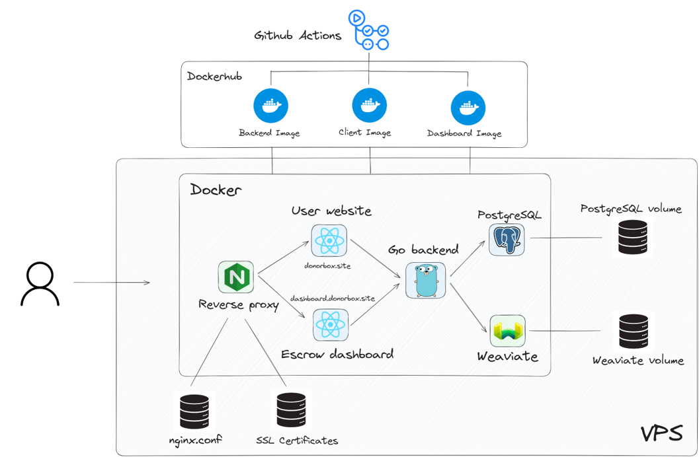

# Donorbox - A charity crowdfunding system

A proof of concept charity crowdfunding system. It offers a user website for basic crowdfunding functionalities: browsing fundraisers, fundraiser management, donation,... with simple AI assistance implemented through RAG(using Gemini and Weaviate DB). In addition, it provides an admin portal for escrow users to manage approvals of user documents, fundraisers, milestones, proofs of expenditure and reports.

## Running locally

1. Make sure [docker compose](https://docs.docker.com/compose/) is installed
2. Clone the repository
3. Create `.env` and fill in based on `.env.example`
4. Run `docker compose up -d`
5. Visit `localhost:4001` for user website, `localhost:4002` for admin dashboard

## Screenshots

## Deployment

Deployment to remote machine is done using:
- Github Actions for pushing Docker images to Container Registry.
- Docker Compose to run images.
- Nginx for reverse proxy to the respective container.
- Certbot for issuing SSL certificates.

## Technologies

- [Golang](https://go.dev)
- [ReactJS](https://react.dev)
- [PostgreSQL](https://www.postgresql.org)
- [Weaviate](https://weaviate.io)
- [TailwindCSS](https://tailwindcss.com)
- [Docker](https://www.docker.com)

## Author

* nguyendung2002hl@gmail.com